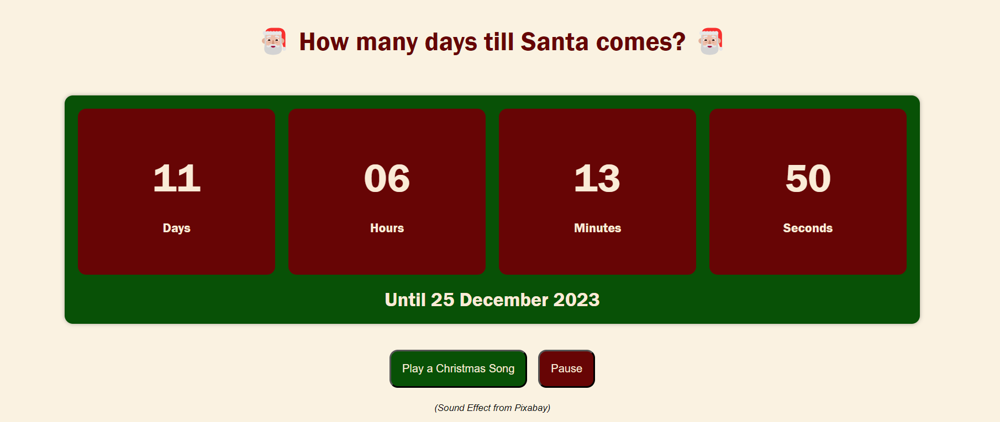

# How many days till Santa comes?

## Deployed application link

## Description

A simple desktop application counting down the days until Christmas 🎄🎅🏼🎁

I worked on this small project to practice the use of Day.js, as well as adding some fun audio event listeners. The countdown will stop on Christmas Day, displaying a festive message. Enjoy!

## Instllation

N/A

## Usage

This application is not mobile friendly yet, although I'd like to re-work it to make it more accessible for next year. Here's what it looks like at the moment:

## Credits

The main functionality of the countdown is from a tutorial by DCode: Build a "Days Until" Countdown Timer with HTML, CSS & JavaScript - Beginner's Project Tutorial (https://www.youtube.com/watch?v=Zr2kBYzcJ14)

I have then added my own sparkle to the basic timer built through it ✨

## License

MIT License

Copyright (c) 2023 Alexandra Asanache

Permission is hereby granted, free of charge, to any person obtaining a copy
of this software and associated documentation files (the "Software"), to deal
in the Software without restriction, including without limitation the rights
to use, copy, modify, merge, publish, distribute, sublicense, and/or sell
copies of the Software, and to permit persons to whom the Software is
furnished to do so, subject to the following conditions:

The above copyright notice and this permission notice shall be included in all
copies or substantial portions of the Software.

THE SOFTWARE IS PROVIDED "AS IS", WITHOUT WARRANTY OF ANY KIND, EXPRESS OR
IMPLIED, INCLUDING BUT NOT LIMITED TO THE WARRANTIES OF MERCHANTABILITY,
FITNESS FOR A PARTICULAR PURPOSE AND NONINFRINGEMENT. IN NO EVENT SHALL THE
AUTHORS OR COPYRIGHT HOLDERS BE LIABLE FOR ANY CLAIM, DAMAGES OR OTHER
LIABILITY, WHETHER IN AN ACTION OF CONTRACT, TORT OR OTHERWISE, ARISING FROM,
OUT OF OR IN CONNECTION WITH THE SOFTWARE OR THE USE OR OTHER DEALINGS IN THE
SOFTWARE.
